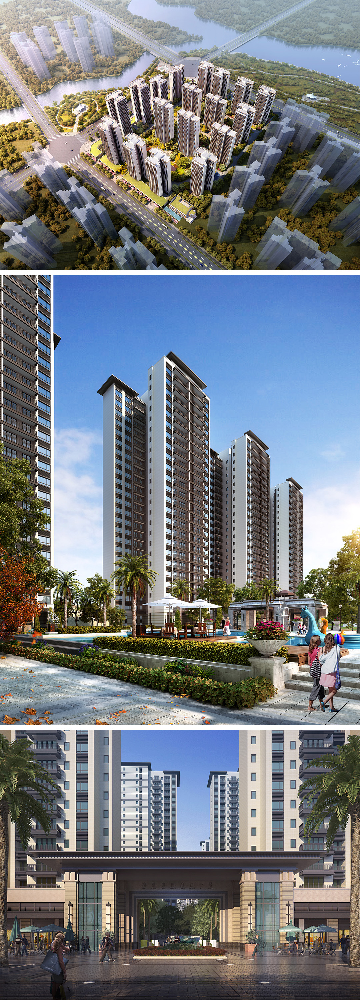

#### 湛江海蓝奥园滨江华府  
> 时间：2019年  
> 类型：高层  
> 风格：新古典  
> 阶段：方案设计  
 
   

#### 天津中储城邦栎树湾  
> 时间：2016年  
> 类型：高层+叠拼  
> 风格：法式+英式  
> 阶段：方案设计   

  

#### 郑州天伦庄园  
> 时间：2014年  
> 类型：叠拼  
> 风格：英式  
> 阶段：方案设计   

  

#### 九龙仓时代上城  
> 时间：2009年  
> 类型：高层  
> 风格：现代  
> 阶段：方案设计   

