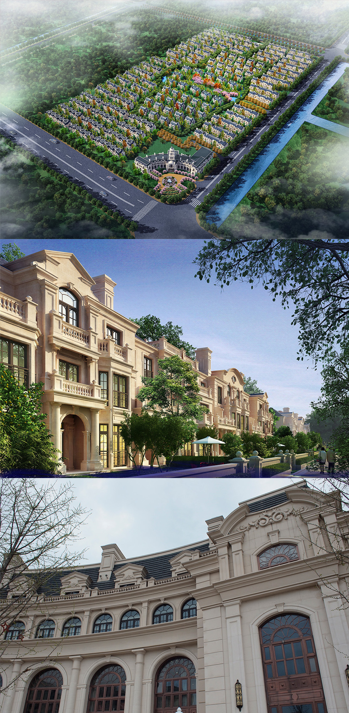
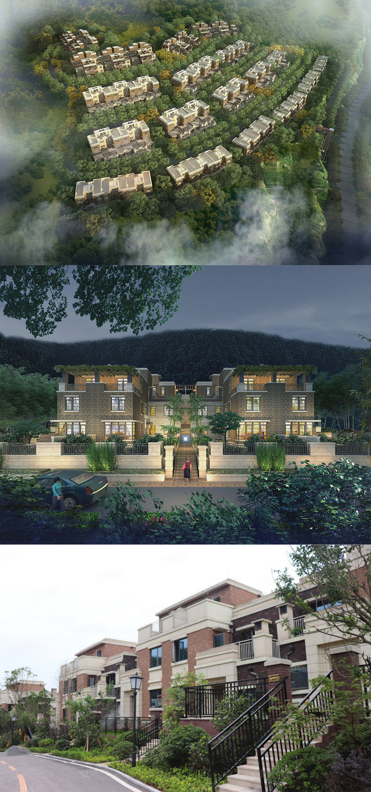
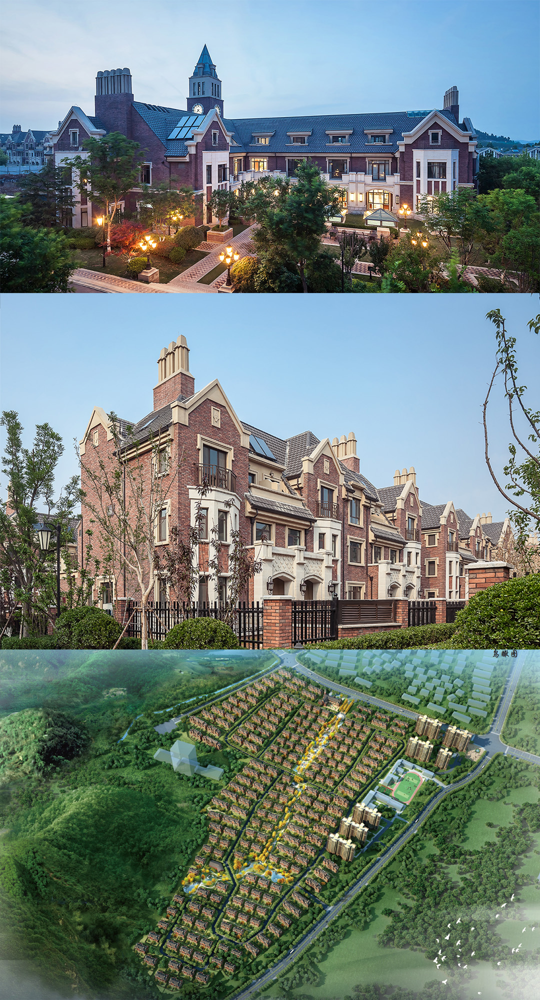
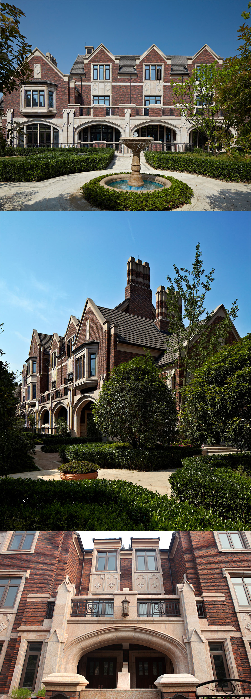

#### 昆山金大元御珑宫廷  
> 时间：2015年  
> 类型：联排  
> 风格：法式  
> 阶段：方案设计  
 
   

#### 重庆鲁商云山雅筑  
> 时间：2014年  
> 类型：联排+叠拼  
> 风格：新古典  
> 阶段：方案设计   

  

#### 济南龙山希思庄园  
> 时间：2014年  
> 类型：联排  
> 风格：英式  
> 阶段：方案设计   

  

#### 杭州西溪玫瑰  
> 时间：2010年  
> 类型：联排  
> 风格：英式  
> 阶段：方案设计   

